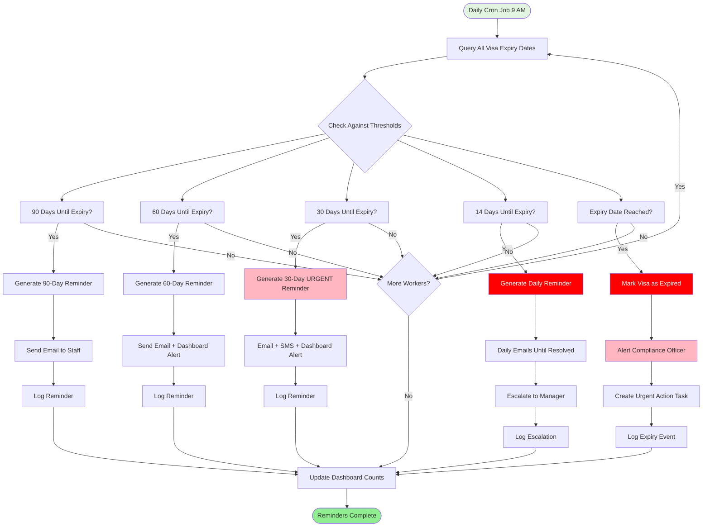

# User Workflow Diagrams (Mermaid)

**Document Information**
- **Version**: 1.0
- **Date**: November 10, 2025
- **Status**: Draft
- **Related Documents**: prd.md, workflows.md

---

## Table of Contents

1. [Candidate Application Flow](#1-candidate-application-flow)
2. [Agency Review Flow](#2-agency-review-flow)
3. [Job Posting Management Flow](#3-job-posting-management-flow)

---

## 1. Candidate Application Flow

### 1.1 Complete Candidate Application Journey

### 1.2 Document Upload Process (Detailed)

### 1.3 Form Validation Flow (Phase 0 vs Phase 1)

---

## 2. Agency Review Flow

### 2.1 Complete Agency Review Journey

### 2.2 Status Change Workflow (Phase 0 vs Phase 1)

### 2.3 Profile Generation Process

### 2.4 Export Candidates Flow (Phase 0)

---

## 3. Job Posting Management Flow

### 3.1 Complete Job Posting Creation Flow

### 3.2 Job Edit Flow

### 3.3 Job Archive Flow (Manual & Auto)

### 3.4 Job Sharing Flow (Phase 1)

---

## 4. Alternative Paths & Error Scenarios

### 4.1 Error Recovery Flow (Application)

### 4.2 Duplicate Application Prevention

---

## 4. Compliance & Workforce Management Flows (Phase 1 & 2)

### 4.1 Visa Expiry Monitoring Flow

### 4.2 Automated Reminder System Flow (Phase 2)

### 4.3 Right-to-Work Document Upload Flow (Phase 1 & 2)

### 4.4 Reportable Events Tracking Flow (Phase 2)

---
